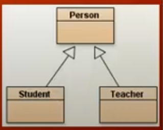

Demo: People at the College

- There are two types of people: Students and Teachers

- All people have an ID, Name, and Email

- IDs differ: students 9 digits, teachers (6 digits/upper-case alpha)

- For Students we want to maintain a list of courses taken (up to 30
  courses) and associated grades; we want to obtain overall grade
  averages as well

- For Teachers we know they can teach up to four courses
  per term; we want a way to add courses to that list

