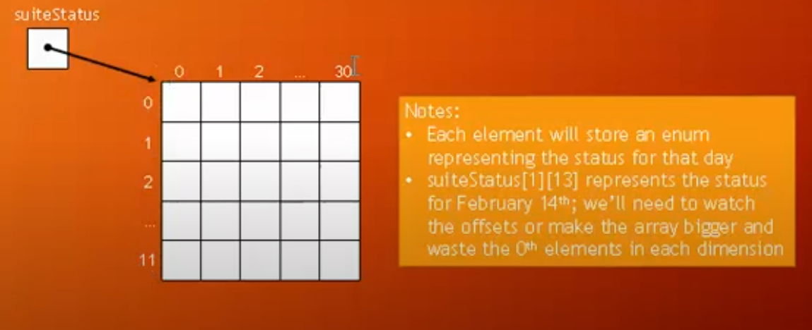

Demo: Hotel Suite Booking

- We want a way to map out the whole year and know whether the
  Happy Holiday Hotel's suit is booked on a given day of
  the year, or whether it is available on that day
- We'll use a two-dimensional array to solve the problem
- Later we'll consider how we might extend the solution to cover all
  the rooms in the hotel, or even more hotels

What Data Structure Should We Use?

- We need to store 366 days of data for 2016
- We could use a one-dimensional array with 366 items, but we'd
  forever be calculating days vs. calendar
- Let's consider a two dimensional array for this
    - 1st dimension would represent the month
    - 2nd dimension would represent the day
    - For the moment, let's pretend all the months have 31 days
- For each day we could use an enum, "booked", "open", "na" (not applicable)

