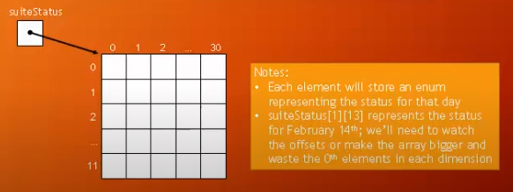

### [ Hotel Room Booking ]

- We want a way to map out the whole year and know whether
      the Happy Holiday Hotel's room is booked on a given day
      of the year, or whether it is available that day.

- We'll use a two-dimensional array to solve the problem

- Later we'll consid er how we might extend the solution to cover all the rooms at the hotel, or even more hotels

-----------------------------------------------------------------

#### [ What data structure should be used to store the days of the year? ]

- We need to store 366 days of data for 2016 (leap year)
- We could use a one-dimensional array with 366 items, but we'd forever be calculating days vs. calendar
- Let's consider a two-dimensional array for this
    - 1st dimension would be for the current month
    - 2nd dimension would be for the current day
    - For the moment, assume all the months have 31 days
- For each day, use an enum with "booked", "open", and "na" (not applicable, to account for the months without 31 days)

